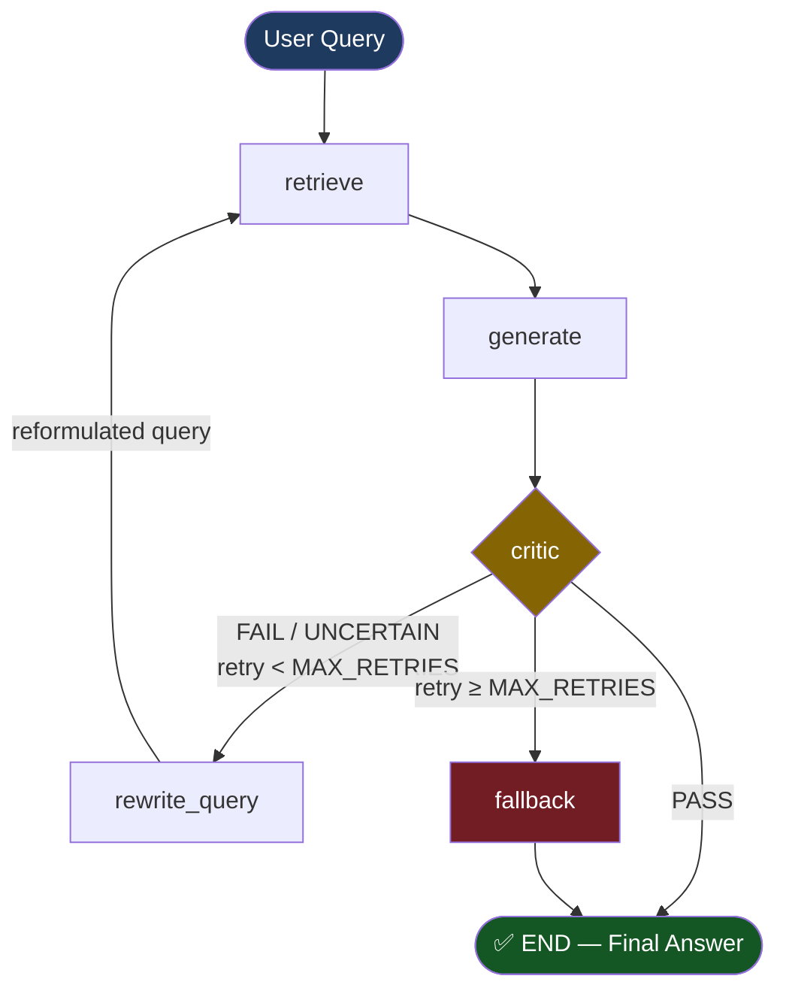

# 🔄 Self-Healing RAG Pipeline

A production-ready **Retrieval-Augmented Generation** system built with **LangGraph**, **LangChain**, and **Ollama** (or OpenAI) that critiques its own outputs and self-corrects before returning answers to the user.

---

## 🏗️ Architecture

The pipeline follows a cyclic graph pattern to ensure high-quality, grounded responses.



### Key Logic
1.  **Retrieve**: Fetches context from a local ChromaDB vector store.
2.  **Generate**: Drafts an initial answer based *only* on the retrieved chunks.
3.  **Critic**: An independent LLM fact-checks the answer against the source chunks.
4.  **Rewrite**: If the answer is ungrounded or incomplete, the query is reformulated to find better documents.
5.  **Fallback**: If high-quality info isn't found after 3 retries, it provides a safe "I don't know" message instead of hallucinating.

---

## 📁 Project Structure

```text
self_healing_rag/
├── main.py              # Entry point: CLI, startup, final output
├── graph.py             # LangGraph StateGraph definition + routing logic
├── nodes.py             # Logic for each node (retrieve, generate, critic, etc.)
├── state.py             # RAGState schema (TypedDict)
├── vectorstore.py       # ChromaDB setup + document ingestion
├── prompts.py           # Centralised prompt templates
├── config.py            # Tunable constants (models, retries, etc.)
├── documents/           # Place your .txt source files here
├── run_rag.bat          # Easy-run batch file for Windows
└── requirements.txt     # Python dependencies
```

---

## 🚀 Quick Start (Windows)

### 1. Install Dependencies
Ensure you have Python 3.10+ installed, then run:
```powershell
pip install -r requirements.txt
```

### 2. Set Up Models (Ollama)
The project is configured to use **Ollama** for local execution. 
1.  Install [Ollama](https://ollama.com/).
2.  Pull the required model (we use `tinyllama` by default for speed):
    ```powershell
    ollama pull tinyllama
    ```

### 3. Run the Pipeline
Simply double-click **`run_rag.bat`** or run:
```powershell
.\run_rag.bat
```

To run a custom question:
```powershell
.\run_rag.bat --query "How does the refund policy work for digital items?"
```

---

## ⚙️ Configuration

You can easily swap models or tune the "healing" threshold in `config.py`:

| Constant | Default | Description |
| :--- | :--- | :--- |
| `MAX_RETRIES` | `3` | Max rewrite cycles before giving up |
| `GENERATOR_MODEL` | `tinyllama` | The LLM used to draft answers |
| `CRITIC_MODEL` | `tinyllama` | The LLM used to fact-check |
| `EMBEDDING_MODEL` | `all-MiniLM-L6-v2` | Local HuggingFace embedding model |

---

## 🧱 Tech Stack
*   **Orchestration**: [LangGraph](https://github.com/langchain-ai/langgraph)
*   **Framework**: [LangChain](https://python.langchain.com/)
*   **Local LLMs**: [Ollama](https://ollama.com/)
*   **Vector Store**: [ChromaDB](https://www.trychroma.com/)
*   **Embeddings**: [HuggingFace](https://huggingface.co/)

---

## ⚠️ Known Issues & Fixes
*   **Windows Hangs**: If the application hangs during "Building vector store", ensure `$env:TOKENIZERS_PARALLELISM="false"` is set (handled automatically by `run_rag.bat`).
*   **Encoding**: All ASCII symbols are used to ensure compatibility with standard Windows Command Prompt (cmd.exe).
